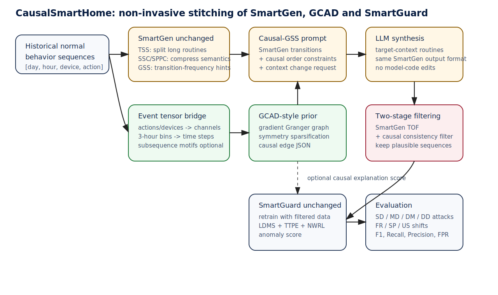

# 任务二：缝合 SmartGuard、SmartGen 与 GCAD 的可行性与方案

## 1. 总结结论

可行，而且应当采用“非侵入式胶水层”方案：不重写 SmartGuard、SmartGen、GCAD 的模型主体，不把三者代码揉成一个新模型，而是在三处边界做粘合：

1. **数据桥接**：把 SmartGuard/SmartGen 的离散行为序列转换为 GCAD 可处理的多变量事件时间序列。
2. **生成前约束**：把 GCAD-style 因果图转成 JSON causal hints，作为 SmartGen GSS prompt 的补充。
3. **生成后过滤/排序**：在 SmartGen TOF 后增加 causal consistency filter，只保留既符合目标上下文、又不明显违反历史因果结构的序列。
4. **下游再训练**：用过滤后的合成数据增广目标上下文训练集，按原 SmartGuard 流程训练和评估。

这不是把 GCAD 塞进 SmartGuard，也不是把 SmartGen 改成因果生成器，而是让 GCAD 作为“因果先验提供者”，SmartGen 作为“上下文迁移数据生成器”，SmartGuard 作为“最终异常检测器”。

---

## 2. 为什么能缝合

### 2.1 数据层可连通

SmartGuard 与 SmartGen 都使用智能家居行为序列，行为可以表示为 `[day, hour_slot, device_id, action_id]`。GCAD 需要多变量时间序列 `[T,C]`。只要定义：

- channel = action / device / device-action / 子序列 motif；
- time step = 3 小时槽，或更细粒度时间 bin；
- value = 是否发生、发生次数、或时间衰减后的强度；

就可以把一批离散行为序列转换为 GCAD 的多变量事件张量。这个转换不改变原项目，只是准备 GCAD 输入。

### 2.2 方法层互补

SmartGuard 的强项是时间上下文异常检测，但它依赖训练分布。遇到季节/作息/人数漂移时，正常的新行为可能被误报。

SmartGen 的强项是合成新上下文行为，用来做自适应再训练。但它的 GSS 主要基于行为转移频率，不能明确表达“行为 A 在滞后窗口内会影响行为 B”的非对称因果关系。

GCAD 的强项是从预测器梯度中抽取动态 Granger 因果图，并用正常因果模式偏离检测异常。它能为 SmartGen 提供比一阶转移频次更强的结构约束：不只是“B 常跟在 A 后面”，而是“历史上 A 对 B 的预测有稳定影响，生成时若同时出现 A 与 B，应优先保持这种因果顺序/滞后结构”。

### 2.3 代码层可非侵入

三个项目都有清晰输入输出：

- SmartGen 输入原始序列、上下文变化、设备动作集合，输出合成序列。
- GCAD 输入时间序列，输出因果矩阵/异常分数。
- SmartGuard 输入正常序列训练，输出异常分数/标签。

胶水层只需要读写 pkl/json/csv/prompt，不需要改动原模型。

---

## 3. 能解决什么问题

### 3.1 降低上下文漂移下 SmartGuard 的误报

原 SmartGuard 如果只用 winter/daytime/single 训练，遇到 spring/night/multiple 的正常行为可能重构损失偏高。SmartGen 合成目标上下文数据能缓解这一点。因果增强后，合成数据不只文本上合理、转移频次合理，还应保留关键行为间的因果顺序，因此更适合用于 SmartGuard 再训练。

### 3.2 减少 SmartGen 生成的“局部合理但全局不合理”序列

LLM 可能生成单步看起来合理的序列，但在多步行为链上违反用户习惯。例如“洗碗”出现在“做饭/吃饭”之前，或者“开窗通风”与“关闭安防摄像头”组合出现但上下文不合理。GSS 的一阶频率不能完全过滤这类问题；因果一致性过滤能提供额外约束。

### 3.3 提供更强解释性

SmartGuard 的解释主要来自重构损失和 attention；SmartGen 的解释主要来自生成前提示与 TOF；GCAD 的因果矩阵可以解释哪些行为关系在新序列中被破坏。缝合后可以输出：

- 哪些 causal edges 被保留；
- 哪些 causal edges 被违反；
- 这些违反是否与 SmartGuard 高重构损失位置对应。

---

## 4. 创新点设计

### 创新点 1：面向离散行为序列的事件张量因果桥接

提出 Event Tensor Bridge：将智能家居离散行为序列映射为多变量事件时间序列。每个 action/device/motif 是一个变量通道，每个时间槽是一个观测时刻。这样可以把 GCAD 的梯度 Granger 因果发现迁移到用户行为子序列层面，而不需要修改 GCAD。

### 创新点 2：Subsequence-level Granger Causal Prior

不只建模 action A -> action B 的一阶转移频率，而是基于预测影响得到 action/subsequence i 对 action/subsequence j 的因果强度。这个先验可表达滞后、方向性和非对称结构。

### 创新点 3：Causal-GSS Prompt Augmentation

在 SmartGen GSS 的 transition JSON 基础上，加入 causal JSON hints：

```json
{
  "hint_type": "subsequence_granger_causality",
  "lag": 4,
  "top_causal_edges": [
    {"source": "a:14", "target": "a:15", "weight": 0.82},
    {"source": "a:15", "target": "a:16", "weight": 0.71}
  ]
}
```

LLM 生成时既要适配新上下文，也要尽量保留这些因果顺序。

### 创新点 4：Causal Consistency TOF+

在 SmartGen TOF 之后，增加因果一致性评分：如果生成序列中同时出现 source 和 target，但多数强因果边的顺序/滞后关系被破坏，则降低该序列优先级或剔除。这个模块不替代 SmartGen TOF，而是作为 TOF 后的结构一致性二次检查。

### 创新点 5：Late-stage causal explanation for SmartGuard

训练和推理仍使用原 SmartGuard。额外输出 causal violation report，辅助解释 SmartGuard 报警原因。可选地，在论文实验中报告 SmartGuard anomaly score 与 causal inconsistency score 的相关性，但不把它硬塞进 SmartGuard 模型内部。

---

## 5. 缝合后的模型框架

框架图文件：`docs/figures/framework.svg`。



流程分为六步：

1. **原始正常行为数据输入**：使用 SmartGen/SmartGuard 的 `[day,hour,device,action]` 格式。
2. **SmartGen 原流程**：TSS 切分，SSC/SPPC 压缩，GSS 生成转移频率 hints。
3. **事件张量桥接与 GCAD-style 因果挖掘**：把正常行为序列转为事件时间序列，训练预测器，计算梯度因果图，稀疏化得到正常 causal prior。
4. **Causal-GSS prompt**：把 causal prior 与 GSS transition hints 合并，形成 LLM prompt。
5. **生成与过滤**：LLM 输出目标上下文行为序列，先经 SmartGen TOF，再经 causal consistency filter。
6. **SmartGuard 再训练/评估**：把保留的合成序列加入目标上下文训练数据，用原 SmartGuard 训练并在 SD/MD/DM/DD 攻击上测试。

---

## 6. 具体实现方案

### 6.1 数据标准化

定义统一数据结构：

```python
BehaviorEvent(day, hour_slot, device, action)
BehaviorSequence(list[BehaviorEvent])
```

支持 SmartGuard/SmartGen 的扁平 pkl 序列读写：

```python
[day, hour, device, action, day, hour, device, action, ...]
```

### 6.2 Event Tensor Bridge

输入：正常行为序列集合 `S={s_1,...,s_n}`。

输出：多变量事件张量 `X in R^{T x C}`。

可选通道粒度：

- action-level：`channel = action_id`，推荐主实验使用。
- device-level：`channel = device_id`，作为消融。
- device-action-level：`channel = (device_id, action_id)`，更细但更稀疏。
- motif-level：把 SmartGen TSS 后的高频子序列 motif 聚类为通道，作为扩展实验。

时间粒度建议先沿用源码中的 3 小时槽，因为 SmartGuard 和 SmartGen 都使用 hour slot；若数据允许，可扩展为 1 小时或分钟级。

### 6.3 GCAD-style Causal Prior Mining

训练预测器 `f`：

```text
X[t-lag:t-1] -> X[t]
```

对输出通道 `j` 的预测损失 `L_j` 分别反向传播，得到输入通道 `i` 在 lag 窗口内的绝对梯度均值：

```text
A[i,j] = mean_tau | d L_j / d X[t-tau,i] |
```

然后做 GCAD 风格稀疏化：

```text
A_sparse[i,j] = max(0, A[i,j] - A[j,i])
diag(A_sparse) = diag(A)
A_sparse[A_sparse < h] = 0
```

得到 `causal_prior.json`。

### 6.4 Causal-GSS Prompt

保留 SmartGen 原 GSS transition hints，再附加因果 hints。Prompt 中明确告诉 LLM：

- 生成目标上下文行为；
- 不产生设备集合外动作；
- 对原上下文无关的行为保持用户习惯；
- 如果 source 与 target 同时出现，尽量保持 causal edge 的顺序和滞后；
- 如果新上下文确实改变设备使用，可解释性地替换，而不是随机颠倒因果链。

### 6.5 Causal Consistency Filter

对每条生成序列，统计 top-k 因果边是否被满足：

```text
coverage(s) = satisfied_edge_weight / checked_edge_weight
```

如果序列中 source 和 target 都出现，但 target 在 source 之前，则视为违反。若某个设备因上下文迁移消失，则不硬惩罚，而是不计入 checked edges。阈值 `min_coverage` 由验证集选择。

### 6.6 SmartGuard 再训练

训练集设置：

```text
train = original_normal + target_context_generated_filtered
validation = target_context_validation_normal
test = target_context_normal + injected_attacks
```

使用原 SmartGuard 的 `train.py` 和 `evaluate_smartguard.py`，不改模型。

---

## 7. 主实验设计

### 7.1 数据集

推荐主实验使用 SmartGuard/SmartGen 共用的 FR、SP、US 数据。

三类上下文漂移：

1. ST：winter -> spring。
2. TT：daytime -> night。
3. NT：single -> multiple。

异常类型使用 SmartGuard 设置：

- SD：Light/Camera/TV flickering。
- MD：window/camera 与 smartlock 组合异常。
- DM：air conditioner cool in winter、window/watervalve at midnight。
- DD：shower/microwave/watervalve long duration。

### 7.2 训练/验证/测试

正常数据：

- 原上下文正常数据用于 SmartGen 压缩、GSS、GCAD 因果先验学习。
- 目标上下文少量验证正常数据用于 SmartGuard 阈值和生成筛选阈值调参。
- 目标上下文正常测试数据 + 注入异常构成测试集。

如果严格模拟“目标上下文数据尚未收集”的场景，可只使用原上下文数据和合成数据训练，再用目标上下文测试集评估；验证阈值采用原上下文验证集或无标签分位数估计。

### 7.3 对比方法

1. SmartGuard-Original：只用原上下文训练。
2. SmartGuard-Oracle：用真实目标上下文正常数据训练，上限参考。
3. SmartGen+SmartGuard：原 SmartGen 生成数据再训练。
4. SmartGen+TOF+SmartGuard：原 SmartGen 加 TOF。
5. Proposed：SmartGen + Causal-GSS + TOF + Causal Filter + SmartGuard。
6. Proposed w/o Causal-GSS：不在 prompt 加因果，只做后过滤。
7. Proposed w/o Causal Filter：只在 prompt 加因果，不后过滤。
8. Transition-only Filter：只用 GSS 转移频率一致性过滤，验证 Granger 因果的必要性。

### 7.4 指标

异常检测：Recall、Precision、F1、FPR、FNR。重点看上下文漂移下 Precision/FPR 是否改善，同时 Recall 不明显下降。

生成质量：

- Causal Coverage：强因果边覆盖率。
- Transition KL/JS：生成数据和真实目标上下文的转移分布距离。
- Device/action distribution shift：目标上下文相关设备使用比例是否变化。
- TOF rejection rate 与 causal rejection rate。

### 7.5 消融实验

- 通道粒度：action vs device vs device-action。
- lag：1、2、4、8。
- sparse threshold h：0、0.001、0.005、0.01。
- top-k causal edges：10、20、50。
- min_coverage 阈值。
- 是否使用时间衰减。

### 7.6 预期现象

1. SmartGen 可以提升漂移场景下 SmartGuard 的 Precision。
2. Causal-GSS 与 causal filter 应进一步减少语义合理但结构违背的生成序列，提高 F1。
3. 对 MD、DM、DD 类异常提升更明显，因为这些异常更依赖行为关系、时刻和持续时间。
4. 过高的 causal filter 阈值可能牺牲多样性，导致 Recall 或泛化下降，因此需要验证集调参。

---

## 8. 风险与规避

| 风险 | 原因 | 规避 |
|---|---|---|
| 行为事件张量过稀疏 | action/device-action 通道多，序列短 | 从 action-level 主实验开始；使用时间衰减或更粗时间 bin |
| GCAD 因果边把频次误当因果 | 观测数据非干预，Granger 是预测因果 | 论文中称为 Granger causal prior，不宣称真实物理因果 |
| LLM 忽略 causal hints | prompt 太长或冲突 | top-k 限制、JSON 格式、后过滤兜底 |
| 过滤太严损失新上下文多样性 | 原上下文因果不完全适合新上下文 | 对缺失边不惩罚，只惩罚同时出现但顺序明显违反的边 |
| SmartGuard/SmartGen vocab 不一致 | padding 和 action id 数量不同 | 统一 dictionary adapter，检查 max id 和 padding id |

---

## 9. 论文可写成的核心命题

本文不是提出一个替代 SmartGuard/SmartGen/GCAD 的大一统模型，而是提出：

> 在智能家居行为漂移场景中，LLM 合成数据需要保留用户历史行为的高阶因果结构；通过非侵入式事件张量桥接，可以把 GCAD 的梯度 Granger 因果图转化为 SmartGen 的生成约束与过滤依据，从而提升 SmartGuard 在目标上下文下的无监督异常检测鲁棒性。
